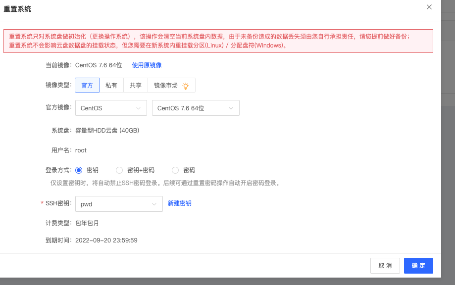
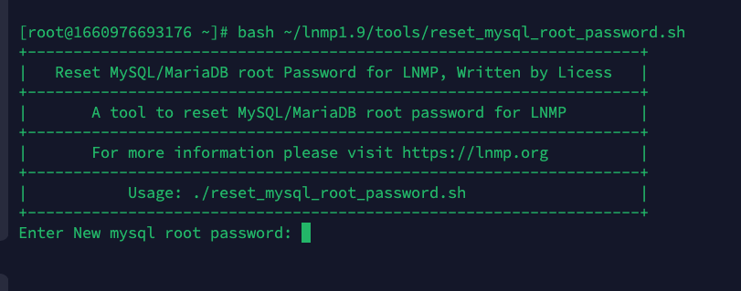

# 😄 程序安装


**感谢使用**,super-forum安装可能对建站小白不太友好,请保持一颗爱学习的心


## 服务器选择

对配置没有过硬的要求，但是推荐以下配置高速运行:


2核CPU, 2G RAM内存 , 大于10G硬盘



腾讯云服务器推荐



腾讯云服务器推荐


## 系统选择


强烈建议Centos 7.\* ，兼容性高，运行速度快，遇到问题可更快解决。



Ubuntu,Debian 等系统可能会出现权限问题，如有动手能力可忽略此条内容




## 安装

### 从零开始

#### 运行环境一键安装命令


目前只支持centos,tencentOs


```bash
# 国内服务器
wget https://gh.api.99988866.xyz/https://raw.githubusercontent.com/Super-Forum/install/main/centos-install.sh && bash centos-install.sh
# 国外服务器
wget https://raw.githubusercontent.com/Super-Forum/install/main/centos-install.sh && bash centos.install.sh
```

运行环境安装好之后,我们做一下简单配置


如果你服务器对国外网络友好，可以执行以下命令还原composer镜像源,composer原镜像不会有缓存


```bash
composer config -g repo.packagist composer https://packagist.org
```

然后修改一下数据库默认root密码

```bash
bash ~/lnmp1.9/tools/reset_mysql_root_password.sh
```



然后输入新密码后回车即可

#### 接下来创建数据库

```bash
lnmp database add
```

.png>)

出现以上提示输入数据库root密码后回车即可

.png>)

如上图，需要输入要创建的数据库名

.png>)

最后输入数据库密码后回车即可完成数据库创建！如下图所示

.png>)

#### 创建网站项目

```bash
cd ~ && composer create-project zhuchunshu/super-forum
```

.png>)

出现上图提示输入yes之后回车即可

.png>)

出现以上提示，输入y然后回车即可

#### 完成安装

以上任务完成后,我们cd 到程序目录下进行最后几步安装

```bash
cd ~/super-forum
```

执行程序启动命令

```bash
php CodeFec CodeFec
```

然后根据提示配置相关信息并重新运行启动命令

.png>)

一直到最后一步出现如上图提示时，把运行命令改为:

```bash
nohup php CodeFec CodeFec &
```

以上命令的意思就是让super-forum 服务在后台运行

然后访问IP:9501即可

如果要绑定域名，请走反向代理的方式反代以下两个端口


WEB服务: IP:9501

WS服务: IP:9502


详细方法请看:&#x20;



### 宝塔面板


宝塔自带Bug多！强烈建议从零开始


宝塔面板安装完成之后，需要安装以下软件

| 软件名   | 版本号            |
| ----- | -------------- |
| Mysql | 5.6以上 , 推荐 5.7 |
| Redis | 5.\* 以上版本      |
| PHP   | 8.0            |
| Nginx | 推荐1.18以上版本     |

以上软件安装完成之后，安装PHP扩展

可以一键安装 fileinfo 和 redis扩展

.png>)

还有swoole 扩展需要我们手动编译安装,(不手动编译安装没法用,宝塔太拉了)

#### 编译安装swoole&#x20;

```bash
cd /www/server/php/80/src/ext
wget https://wenda-1252906962.file.myqcloud.com/dist/v4.8.11/swoole-src-4.8.11.tar.gz -O swoole.tar.gz
tar zxvf swoole.tar.gz && rm -rf swoole.tar.gz
mv swoole-src* swoole-src
cd swoole-src
/www/server/php/80/bin/phpize && ./configure --enable-openssl --enable-http2 --with-php-config=/www/server/php/80/bin/php-config
sudo make && make install
echo "[swoole]" >> /www/server/php/80/etc/php.ini
echo "extension = /www/server/php/80/lib/php/extensions/no-debug-non-zts-20200930/swoole.so" >> /www/server/php/80/etc/php.ini
echo "[swoole]" >> /www/server/php/80/etc/php-cli.ini
echo "extension = /www/server/php/80/lib/php/extensions/no-debug-non-zts-20200930/swoole.so" >> /www/server/php/80/etc/php-cli.ini
```

#### 修改php配置文件

```bash
sed -i 's/disable_functions =.*/disable_functions =/g' /www/server/php/80/etc/php.ini
echo "swoole.use_shortname='Off'" >> /www/server/php/80/etc/php.ini
sed -i 's/disable_functions =.*/disable_functions =/g' /www/server/php/80/etc/php-cli.ini
echo "swoole.use_shortname='Off'" >> /www/server/php/80/etc/php-cli.ini
```

#### 创建数据库

.png>)

#### 创建网站项目

```bash
cd /www/wwwroot && composer create-project zhuchunshu/super-forum
```

​


出现这个提示输入yes之后回车出现上图提示输入yes之后回车即可​


出现此提示输入y然后回车出现以上提示，输入y然后回车即可

#### 完成安装 <a href="#wan-cheng-an-zhuang" id="wan-cheng-an-zhuang"></a>

以上任务完成后,我们cd 到程序目录下进行最后几步安装

```bash
cd /www/wwwroot/super-forum
```

执行程序启动命令

```bash
php CodeFec CodeFec
```

然后根据提示配置相关信息并重新运行启动命令


​一直到最后一步出现如上图提示时，把运行命令改为:

```bash
nohup php CodeFec CodeFec &
```

以上命令的意思就是让super-forum 服务在后台运行

然后访问IP:9501即可如果要绑定域名，请走反向代理的方式反代以下两个端口


WEB服务: IP:9501

WS服务: IP:9502


详细方法请看:


